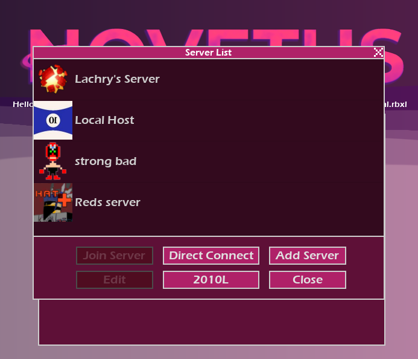

 # NovetusFE
 This program is no longer supported by its developer, consider forking it.
 A frontend application made for Novetus, by https://bitl.itch.io
 
 # Whats it for?
 NovetusFE is a launcher for a launcher, providing new quality of life features such as a Workshop, an Addon Manager, a Local Server List with custom icons and Custom Themes.
 ## Title Screen
 
 ## Workshop
 
 ## Custom Themes 
 
 ## Addon Manager 
 
 ## Server List
 
 
 # Installation
 Place the NovetusFE binary inside of your Novetus Install Directory
 ## Custom Theme Example
 https://github.com/Lachrymogenic/Novetus-Stuff/tree/rose-pink-theme
